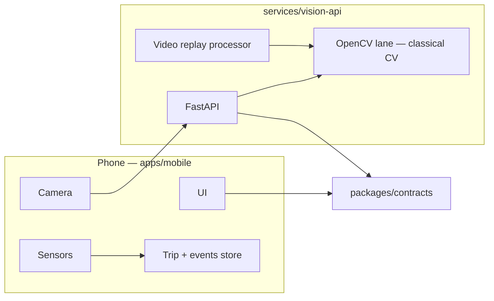
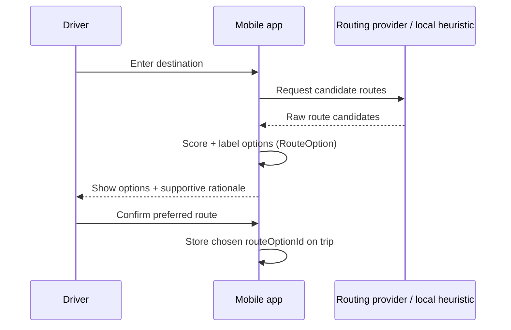
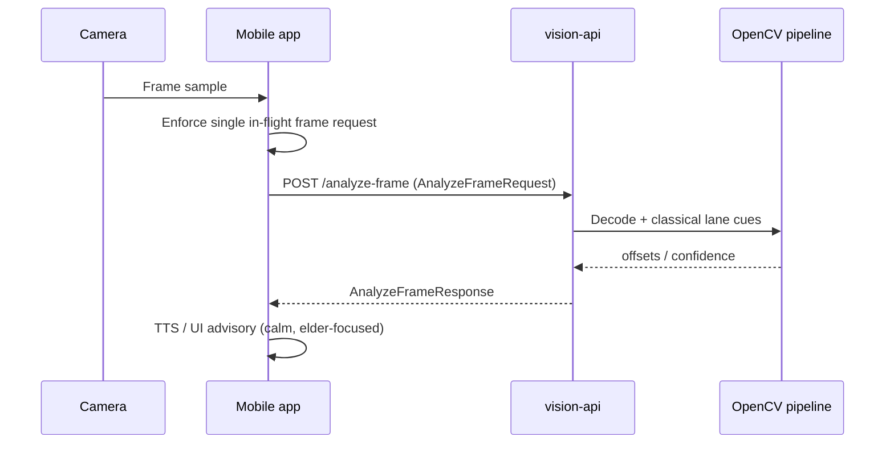
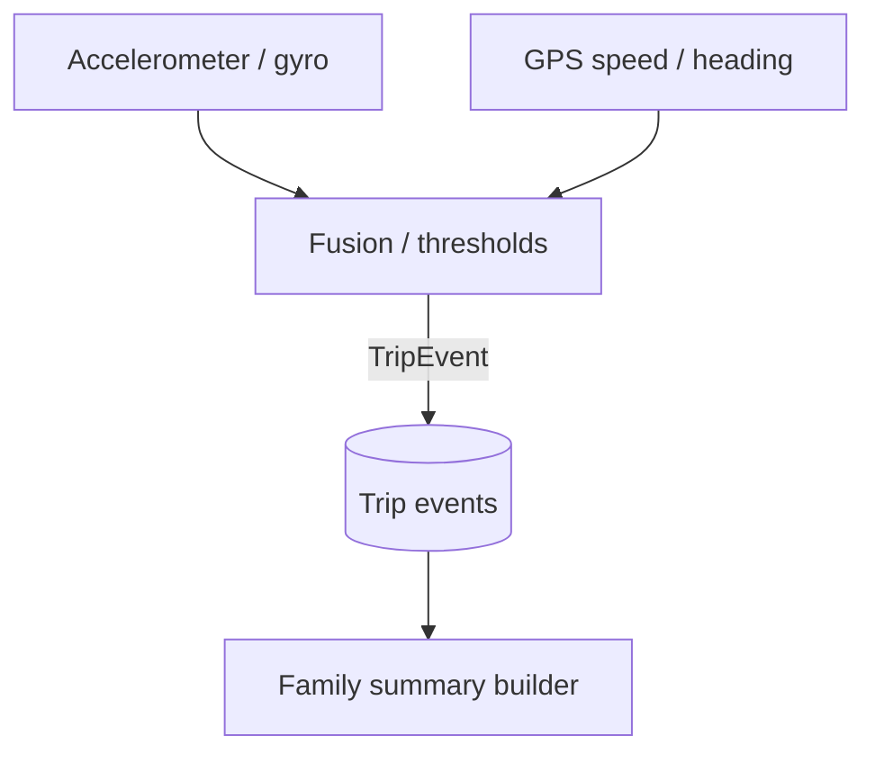
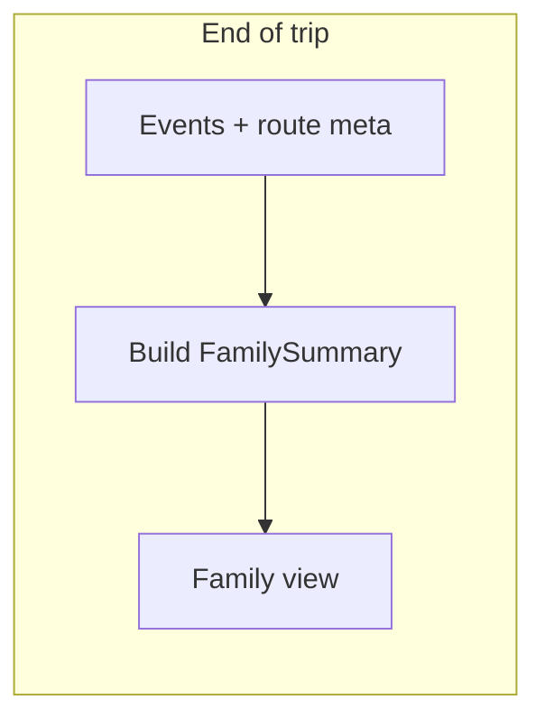

# RoadCopilot architecture

This document describes how the mobile app, vision API, and shared contracts fit together. It is the integration reference for hackathon-style delivery.

## System context

## Route selection flow (pre-drive, MVP required)

Safe routing is a **required** MVP feature: the driver sees ranked **route options** with calm rationales before starting.

*Note:* Backend may assist with scoring later; the **`RouteOption` contract** is the cross-team handshake regardless of where scoring runs.

## Live camera frame flow (lane advisory)

Lane drift uses **on-device** sensing where possible; the **vision API** handles frame analysis and aligns with **replay mode**. The mobile client must keep **at most one** `POST /analyze-frame` request in flight.

## Sensor event flow (on-device)

Hard braking, rapid acceleration, and sharp swerves are detected **on the phone** using IMU/GPS-derived signals. Events conform to **`TripEvent`** and feed the post-trip summary.

## Trip summary flow (post-trip, MVP required)

The **family summary** is **required** for MVP. Copy must be **supportive and non-punitive**. Replay/demo trips set `derivedFromReplay` when appropriate.

## Replay / demo backup mode

When live camera is unavailable, the app uses **`POST /analyze-video-replay`** so judges or caregivers can run a **demo** path. Responses use **`AnalyzeVideoReplayResponse`**; downstream UX should label demo/replay clearly without alarming the driver.

---

## Contract map

| Endpoint / artifact | TypeScript + JSON Schema |
|---------------------|---------------------------|
| `POST /analyze-frame` | `AnalyzeFrameRequest` / `AnalyzeFrameResponse` |
| `POST /analyze-video-replay` | `AnalyzeVideoReplayRequest` / `AnalyzeVideoReplayResponse` |
| Trip log | `TripEvent` |
| Family UI | `FamilySummary` |
| Pre-drive routes | `RouteOption` |

All live under `packages/contracts/` (`src/` and `schemas/`).
